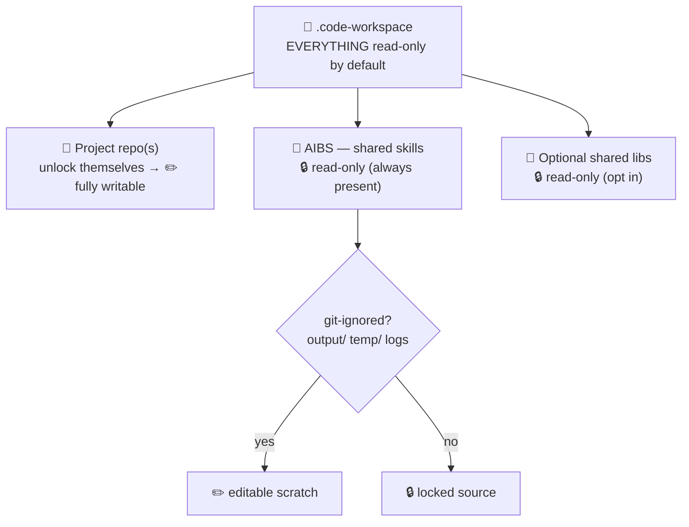
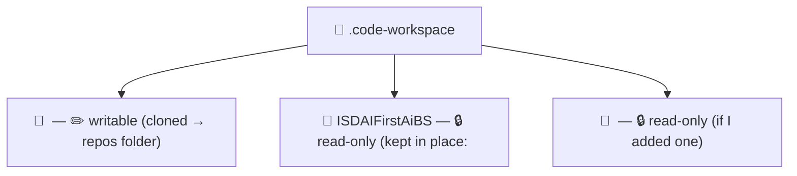

# Multi-repo workspace setup (one prompt, self-cleaning)

Set up (or refresh) a **multi-repo VS Code workspace** following the self-contained model described in this prompt (everything you need is here — **do not read any external file**):

- The workspace file marks **everything read-only by default** (`files.readonlyInclude { "**": true }`).
- Each **project repo** unlocks itself via its own `.vscode/settings.json` (`files.readonlyExclude { "**": true }`).
- The **shared read-only libraries** — **AIBS** (always present) plus any you opt into — stay **read-only** except the paths AIBS git-ignores (its `.gitignore` drives `files.readonlyExclude`).

> **Before you start — AI-First prerequisites.** This prompt **assumes you have already installed all the mandatory prerequisites** that are part of the **AI-First** setup (VS Code, GitHub Copilot, Git, GitHub CLI, Node.js, the MCP servers, etc.). It does **not** install or verify them for you. If onboarding isn't done yet, complete it first using the shared **AIBS** repo:
> - **README → "Prerequisites" chapter** (and "Verify Your Setup" for the automated check): https://github.com/mcaps-microsoft/ISDAIFirstAiBS/blob/main/README.md#2-prerequisites
> - **Enablement deck (PowerPoint):** https://github.com/mcaps-microsoft/ISDAIFirstAiBS/blob/main/docs/AI_First_VSCode_Enablement.pptx

## Defaults (predefined)

- **AIBS (shared skills repo) is baked in** as the always-present shared repo — you do **not** need to provide its URL:
  - `https://github.com/mcaps-microsoft/ISDAIFirstAiBS`
- It is added to **every** workspace automatically and always kept **read-only**. Override it only if you explicitly want a different shared repo.
- **Optional additional read-only libraries** can be added alongside AIBS — **same read-only treatment**, but **none are selected by default**; you opt in per engagement (Step 1). No specific library is pre-proposed — you are simply offered **empty slots** to paste any shared/read-only repo URL you want.

Work through the steps below. Stream progress as you go. **Do not leave any temporary script behind.**

## Step 0 — Explain the concept, the why, and the two folders (do this FIRST)

**State the prerequisites assumption first.** Open by telling me in one line that this setup **assumes the mandatory AI-First prerequisites are already installed** — per the AIBS [**README "Prerequisites"** chapter](https://github.com/mcaps-microsoft/ISDAIFirstAiBS/blob/main/README.md#2-prerequisites) and the [`AI_First_VSCode_Enablement.pptx` deck](https://github.com/mcaps-microsoft/ISDAIFirstAiBS/blob/main/docs/AI_First_VSCode_Enablement.pptx) — and that this prompt won't install them, so I can pause and finish onboarding first if needed.

**(a) Explain the concept and the why.** This prompt is **self-contained** — **do not read any external file**; everything you need is embedded right here. Using only what's in this prompt, tell me, briefly and in plain language:

- **Why we do this:** on a delivery we open several repos side by side in one window — the **shared read-only libraries** we reuse on *every* engagement (**AIBS**, the common *skills & guidance*, **always present**; plus **optionally** any other shared libraries you opt into), plus this engagement's own **project repo(s)**. The shared libraries are refreshed **only by pulling upstream** — never hand-edited — so when they sit open next to project code it's far too easy to break one by accident (a stray edit, a find-and-replace, an AI agent writing into it). This setup lets me **work freely in the project repo(s) while the shared libraries stay protected**.
- **How the protection works:** the `.code-workspace` marks **everything read-only by default**; each **project repo** unlocks itself (`files.readonlyExclude { "**": true }`) so it's fully writable; every **shared library** stays read-only **except** its git-ignored scratch folders (`output/`, `temp/`, logs…) that skills need writable while they run.
- **Be clear-eyed:** this read-only lock is a **local guardrail against *accidental* edits — not a security control**. Real integrity of the shared libraries comes from **branch protection + PR review** on the remote; the workspace lock just stops daily slip-ups.

Render this **model diagram** so I can see the concept at a glance:



**(b) The two folders — a "virtual catalog".** Explain this model to me (the two folders can be the **same** or **different**):

- A central **repos folder** holds **all** cloned repos together — AIBS plus every project's repos, side by side.
- A **workspaces folder** holds the `.code-workspace` files — **one per project**. Each one **cherry-picks** only the repos that project needs, so opening it shows *just those*. It's a curated view — a **virtual catalog** — over the shared pool of repos.

Show me this example layout:

```text
C:\AI First Delivery\
├─ VSCODE\                      ← REPOS folder: ALL clones live here together
│  ├─ ISDAIFirstAiBS\           (shared — used by every project)
│  ├─ projA-dbt\
│  ├─ projA-dev\
│  └─ projB-api\
└─ Workspaces\                  ← WORKSPACES folder: one .code-workspace per project
   ├─ projA.code-workspace      (opens AIBS + projA-dbt + projA-dev)
   └─ projB.code-workspace      (opens AIBS + projB-api)
```

You don't need to run this prompt from any particular folder — you'll **choose both folders in Step 1** (and they can be the same).

## Step 1 — Pre-scan, propose smart defaults, then collect inputs

**First, pre-scan to propose good defaults — don't guess folders.** Materialize the engine now (the **Engine** block at the end → `$env:TEMP\mrw-setup.ps1`; see Step 2) and run a quick scan-only pass:

```
pwsh -NoProfile -ExecutionPolicy Bypass -Command "& '$env:TEMP\mrw-setup.ps1' -ScanOnly"
```

From its output:
- It lists every existing git repo **grouped by parent folder** and prints `PROPOSE-REPOS-FOLDER=<path>` (the folder where most clones already live) plus `FOUND-AIBS=<path>` if AIBS is already cloned.
- Use `PROPOSE-REPOS-FOLDER` as the **proposed default repos folder** — default to wherever my clones already cluster rather than assuming a layout. Tell me what was found.

**The shared AIBS repo is predefined** (see **Defaults** above) — **don't ask for it** unless I want to override it. Now ask me, in order (offer the scan-informed defaults; skip anything I already gave):

1. **Workspaces folder** — home for the `.code-workspace` file(s); I keep all my projects' workspace files here. *Default:* the current folder (`(Get-Location).Path`), or a `Workspaces` sibling next to the proposed repos area if the pre-scan found one. → remember as `<WORKSPACES-FOLDER>`.
2. **Project name** → produces `<name>.code-workspace`.
3. **Project repo URL(s)** (GitHub) — the engagement's own repo(s). **Present this as several separate single-line input fields — one repo per field** (e.g. `Project repo URL #1`, `Project repo URL #2`, `Project repo URL #3`, `Project repo URL #4`, `Project repo URL #5`), so I can paste one repo into each field and add additional repos field-by-field, then just submit/next. Make only the **first** field required; leave the rest **optional/blank**. **Do not** ask for them as a single comma-separated field. Collect every non-empty field, in order, as the project repo URL list. If I fill every field and clearly need more, offer one more round of the same fields.
4. **Additional read-only / shared repo URL(s)** *(optional — none by default)* — extra shared libraries to open **alongside AIBS but keep read-only**. **Present as several separate single-line input fields, ALL optional/blank** (e.g. `Read-only repo URL #1`, `#2`, `#3`, `#4`, `#5`). **Do not pre-fill or suggest any specific repo — just show empty fields** for me to paste any shared/read-only repo URL I want. **Do not** ask for them as a single comma-separated field, and **do not** select any by default. Collect every non-empty field, in order, as `<SHARED-EXTRA-URLS>`. AIBS is always included automatically and is **not** one of these fields.
5. **Repos folder** — where cloned repos are stored. *Default:* the `PROPOSE-REPOS-FOLDER` value from the pre-scan (where my repos already cluster); it can also be the **same** as the workspaces folder, or a **different** central folder that holds **all** clones for **every** project. Newly cloned repos land here as subfolders; repos already cloned elsewhere can stay where they are (Step 3). → remember as `<REPOS-FOLDER>`.

**If the proposed folder (or my existing clones) sit inside OneDrive — still offer it, but recommend moving out.** The pre-scan flags this (`PROPOSE-REPOS-FOLDER-ONEDRIVE=true`). When it does, present **both** and let me choose — **don't silently drop the OneDrive location I already use**:

- **(recommended — good practice) Outside OneDrive:** a user-level repos folder + workspaces folder, e.g. `RECOMMEND-REPOS-FOLDER` (`%USERPROFILE%\VSCODE`) for clones and `%USERPROFILE%\Workspaces` for the `.code-workspace` files. Keeping **cloned git repos off OneDrive** is the recommended practice — default the recommendation here.
- **(as discovered) Inside OneDrive:** the `PROPOSE-REPOS-FOLDER` the scan found — still offered, in case I deliberately want it there.

> **Why OneDrive isn't ideal for cloned repos.** OneDrive continuously syncs every file change, and a git repo's `.git` folder churns thousands of tiny files on every checkout/fetch/branch switch. That can cause: **sync conflicts that corrupt `.git`** (e.g. "…-DESKTOP-xxxx" conflicted copies of `index`/pack files), **file-lock errors** when git and the sync client touch a file at the same instant, **Files-On-Demand placeholders** leaving repo files only partially present on disk, **two machines racing** on the same synced clone, and **slow performance / quota blow-out** from constant re-upload. Small, rarely-changed **workspace files** are usually fine in OneDrive, but **working clones should live on a local, non-synced path** — hence the user-level `VSCODE` folder above.

**If the pre-scan found NO repos (fresh machine):** don't silently invent folders — **propose a recommended structure and ask if I want it generated**:

```text
<BASE>\
├─ Repos\          ← repos folder (all clones live here)
└─ Workspaces\     ← workspaces folder (.code-workspace files)
```

Suggest a sensible `<BASE>` **outside OneDrive** (e.g. `%USERPROFILE%` → `%USERPROFILE%\VSCODE` + `%USERPROFILE%\Workspaces`; avoid OneDrive-synced folders for cloned repos) but let me change it. If I accept, **create both folders** and use them as `<REPOS-FOLDER>` / `<WORKSPACES-FOLDER>`.

**Auto-create any folder I name.** Whenever I give a workspaces or repos folder path that doesn't exist yet, **just use it as typed** — never reject it or treat it as a blocker. The engine creates `<REPOS-FOLDER>` / `<WORKSPACES-FOLDER>` automatically on the real run (Step 4); for the fresh-machine structure above, create them as soon as I accept.

Validate each URL starts with `https://`, `http://`, `git@`, or `ssh://`.

## Step 2 — Materialize the engine to a temp file

Write the PowerShell in the **Engine** section at the end **verbatim** (do not paraphrase or trim it) to:

```
$env:TEMP\mrw-setup.ps1
```

If you already wrote it for the **Step 1 pre-scan**, reuse that same file — don't rewrite it.

## Step 3 — Dry run (no changes), choose clone-vs-keep, then show how it will look

Run it in **preview** mode (AIBS is the engine's predefined `-Shared` default, so only pass `-Shared '<url>'` if I asked to override it; pass any **additional read-only repos** I chose via `-SharedExtra @('<ro-url1>','<ro-url2>')` — omit it entirely if I chose none). **The engine scans every fixed drive for existing clones by default** — every laptop's folder layout is different, so it never assumes any particular structure:

```
pwsh -NoProfile -ExecutionPolicy Bypass -Command "& '$env:TEMP\mrw-setup.ps1' -Project '<name>' -Projects @('<url1>','<url2>') -SharedExtra @('<ro-url1>','<ro-url2>') -ReposRoot '<REPOS-FOLDER>' -WorkspacesRoot '<WORKSPACES-FOLDER>' -DryRun -NoOpen"
```

(Full-drive scan is **on by default**, so existing clones are found wherever they live — no folder-structure assumptions. For a faster, scoped run, add `-NoFullScan` to look only in `<REPOS-FOLDER>` plus any `-SearchRoot` you pass. Use the `-Command "& '…' …"` form with `@('<url1>','<url2>')` arrays — `pwsh -File` does **not** bind comma- or space-separated array values.)

From the dry-run result, tell me **per repo** whether it was **found already cloned somewhere** (and where) or **not found**. If a repo has **more than one** clone on disk (full-drive scan may surface stale backups, e.g. under `old/`), list **all** of them and note which one the engine will use (the first match) so I can redirect or clone fresh if it picked the wrong copy.

**Then, for each repo that is already cloned in a folder OUTSIDE `<REPOS-FOLDER>`, ask me:**

> `<repo>` is already cloned at `<path>`. Keep the **connection to that existing clone** (reference it in place), or **clone a fresh copy** into your repos folder `<REPOS-FOLDER>`? *(default: keep the existing connection)*

Collect the repos I choose to **clone fresh** into a `-ForceClone` list (their URLs). AIBS is normally kept in place unless I say otherwise.

Re-run the dry-run including my choices to finalize the plan:

```
pwsh -NoProfile -ExecutionPolicy Bypass -Command "& '$env:TEMP\mrw-setup.ps1' -Project '<name>' -Projects @('<url1>','<url2>') -SharedExtra @('<ro-url1>','<ro-url2>') -ForceClone @('<urls-i-chose-to-clone-fresh>') -ReposRoot '<REPOS-FOLDER>' -WorkspacesRoot '<WORKSPACES-FOLDER>' -DryRun -NoOpen"
```

Now **render the updated picture of how it will look** — before anything is cloned.

**A folder tree of the two folders** (fill in real names; show the repos folder and the workspaces folder — collapse to one block if I chose the same path):

```text
<REPOS-FOLDER>/                     ← all clones live here
├─ <new-repo>/                     ← will be CLONED here (✏️ writable project repo)
└─ …
<WORKSPACES-FOLDER>/               ← workspace files live here
└─ <name>.code-workspace          ← will be created (cherry-picks this project's repos)

(referenced in place — kept connection to existing clones, left where they are:)
   <path-to-existing-AIBS>          ← AIBS 🔒 read-only
   <path-to-existing-project>       ← ✏️ writable project repo
```

**And a workspace map (Mermaid)** — mark each repo kept-in-place/cloned and read-only/writable, with its real path:



Also show the previewed `.code-workspace` JSON. Then **ask me to confirm** before making any changes.

## Step 4 — Execute for real (only after I confirm)

Re-run the **final** command (the same `-Command "& '…' …"` form with `-Projects @('<url1>','<url2>')`, any `-SharedExtra @('<ro-url1>','<ro-url2>')` read-only repos I added, plus any `-ForceClone @('<urls>')` I chose in Step 3) **without** `-DryRun`. This clones the repos I asked to clone fresh, keeps connections to the ones I chose to reuse in place, **writes the `.vscode/settings.json` unlock file into every project repo so it has write access (never into AIBS or any read-only/shared library)**, generates `<name>.code-workspace`, and opens it in VS Code.

## Step 5 — Clean up (always)

Delete the temp engine and any other temp artifacts you created — even if a step failed:

```
Remove-Item "$env:TEMP\mrw-setup.ps1" -Force -ErrorAction SilentlyContinue
```

The only things left on disk must be: the cloned repos, each project repo's `.vscode/settings.json` unlock file, and the generated `<name>.code-workspace`.

## Step 6 — Summarize

Report each repo (reused vs cloned + final path), the workspace file path, and confirm the temp script was removed.

## Guardrails

- **Every project repo must get write access** — ensure its `.vscode/settings.json` has `files.readonlyExclude { "**": true }` (create it only if missing).
- **Never** create an unlock file inside AIBS **or any additional read-only/shared library** — they must all stay read-only.
- **Additional read-only repos are optional and never default-selected** — only include the ones I explicitly add via `-SharedExtra`. They are matched, reused-in-place, and offered the keep-in-place-vs-clone-fresh choice (Step 3) exactly like any other clone, but they get **no** unlock file.
- **The reverse `.gitignore` logic is mirrored from AIBS only** — the single `-Shared` repo. Additional read-only repos do **not** contribute their own `.gitignore`; they are kept **fully read-only**. Never harvest or merge `.gitignore` from any `-SharedExtra` repo.
- **Never** delete or edit any repo's `.gitignore` (even one that ignores `.vscode/`); honour the existing repo's intent and only ensure the unlock file exists locally.
- Match existing clones by **git origin URL** (normalized across https/ssh), **not** by folder name.
- **Scan the full drive by default — don't assume any folder layout.** Every laptop is different, so the engine scans `$HOME` plus every ready fixed drive to find existing clones wherever they live. Don't hard-code or pass folder-structure-specific `-SearchRoot` values just because of how my disk happens to be organized; only narrow the scan with `-NoFullScan` if I explicitly ask for a faster, scoped run.
- **Propose, don't guess, the repos folder.** Run the `-ScanOnly` pre-pass first and default the repos folder to where my clones already cluster (`PROPOSE-REPOS-FOLDER`); surface what was found so I can confirm or change it.
- **OneDrive-stored clones: still offer the discovered folder, but recommend moving out.** If the proposed repos folder (or existing clones) live under OneDrive (`PROPOSE-REPOS-FOLDER-ONEDRIVE=true`), keep offering that location **and** propose the good-practice alternative outside OneDrive — a user-level `VSCODE` repos folder + `Workspaces` folder (`%USERPROFILE%\VSCODE`, `%USERPROFILE%\Workspaces`). Default the recommendation to **outside OneDrive** (a live `.git` clone on OneDrive risks conflict-copy corruption, file-lock errors, and partial On-Demand files); let me choose either.
- **Fresh machine (no repos found): propose a recommended `<BASE>\Repos` + `<BASE>\Workspaces` structure and ask before creating it** — don't silently invent folders.
- **Auto-create any folder path I provide that doesn't exist** — accept it as typed and use it; the engine creates it on the real run, so a missing folder is never a blocker and you never need to ask whether to create it.
- When a repo already exists elsewhere, **ask me** whether to keep the connection (reference it in place) or clone a fresh copy into the repos folder — default to keeping the existing connection.
- **If full-drive scan finds more than one clone of the same repo**, don't silently pick one — list them all, say which the engine will use (the first match), and let me redirect (move/remove the stale copy) or clone fresh if it chose wrong.
- If an existing `.vscode/settings.json` is present without `files.readonlyExclude`, leave it untouched and flag it for me.

## Engine

```powershell
# Multi-repo workspace engine — materialized to a temp file by the prompt, then deleted.
param(
    # Required for a real run; omitted for -ScanOnly (the pre-scan pass).
    [string]$Project,
    # AIBS is the always-present shared skills repo - predefined default; override only if needed.
    [string]$Shared   = 'https://github.com/mcaps-microsoft/ISDAIFirstAiBS',
    # Additional READ-ONLY / shared library repos - treated exactly
    # like AIBS: kept read-only, NO unlock file. Empty by default; the user opts in per engagement.
    # NOTE: their .gitignore is intentionally NOT harvested - the reverse-.gitignore readonlyExclude
    # logic is mirrored from AIBS ($Shared) ONLY, so these repos stay fully read-only.
    [string[]]$SharedExtra = @(),
    [string[]]$Projects = @(),
    # Repo URLs the user chose to CLONE FRESH into the main folder instead of reusing an existing clone elsewhere.
    [string[]]$ForceClone = @(),
    [string]$ReposRoot      = (Get-Location).Path,
    [string]$WorkspacesRoot = (Get-Location).Path,
    [string[]]$SearchRoot,
    [int]$SearchDepth = 5,
    # Full-drive scan is ON by default (laptops differ - never assume a folder layout).
    # Pass -NoFullScan to limit scanning to -ReposRoot plus any -SearchRoot only.
    [switch]$NoFullScan,
    # Pre-scan pass: list existing git repos grouped by parent folder, print a proposed
    # repos folder (PROPOSE-REPOS-FOLDER=...) and FOUND-AIBS=..., then exit (no Project needed).
    [switch]$ScanOnly,
    [switch]$DryRun,
    [switch]$NoOpen
)
$ErrorActionPreference = 'Stop'

function Write-Info($m){ Write-Host $m -ForegroundColor Cyan }
function Write-Ok($m)  { Write-Host $m -ForegroundColor Green }
function Write-Warn($m){ Write-Host $m -ForegroundColor Yellow }
function Write-Step($m){ Write-Host "`n=== $m ===" -ForegroundColor Magenta }

function Test-RepoUrl([string]$u){ return ($u -and ($u -match '^(https://|http://|git@|ssh://)')) }
function Normalize-RepoUrl([string]$u){
    if(-not $u){ return $null }
    $u = $u.Trim().ToLowerInvariant() -replace '\.git$',''
    $u = $u -replace '^git@([^:]+):','https://$1/'
    $u = $u -replace '^ssh://git@','https://'
    $u = $u -replace '^https?://',''
    return $u.TrimEnd('/')
}
function Get-RepoName([string]$Url){ return (((($Url.Trim().TrimEnd('/')) -replace '\.git$','') -split '[/:]')[-1]) }
function Get-OriginUrl([string]$RepoDir){
    try { $u = & git -C $RepoDir remote get-url origin 2>$null; if($LASTEXITCODE -eq 0 -and $u){ return ($u | Select-Object -First 1).Trim() } } catch {}
    return $null
}
function To-AbsForward([string]$p){
    try { $rp = (Resolve-Path -LiteralPath $p -ErrorAction Stop).Path } catch { $rp = $p }
    return ($rp -replace '\\','/')
}
function ConvertTo-JsonString([string]$s){ if($null -eq $s){ return '' }; return ($s -replace '\\','\\' -replace '"','\"') }

function Test-OneDrivePath([string]$p){
    if(-not $p){ return $false }
    $rp = $p; try { $rp = (Resolve-Path -LiteralPath $p -ErrorAction Stop).Path } catch {}
    foreach($od in @($env:OneDrive,$env:OneDriveCommercial,$env:OneDriveConsumer)){
        if($od -and $rp.ToLowerInvariant().StartsWith($od.ToLowerInvariant())){ return $true }
    }
    return ($rp -match '(?i)[\\/]OneDrive([ ._-][^\\/]*)?[\\/]')
}

$script:SkipDirNames = @('node_modules','.git','bin','obj','.vs','.vscode','.venv','venv','env','__pycache__','$Recycle.Bin','Windows','Program Files','Program Files (x86)','ProgramData','.npm','.nuget','.gradle','.cargo','packages','dist','build','.next','.terraform','AppData')

function Find-GitReposUnder([string]$Root,[int]$MaxDepth){
    $results = New-Object System.Collections.Generic.List[string]
    if(-not (Test-Path -LiteralPath $Root)){ return $results }
    try { $start = (Resolve-Path -LiteralPath $Root).Path } catch { return $results }
    $stack = New-Object System.Collections.Generic.Stack[object]
    $stack.Push([pscustomobject]@{ Path=$start; Depth=0 })
    while($stack.Count -gt 0){
        $cur = $stack.Pop()
        if(Test-Path -LiteralPath (Join-Path $cur.Path '.git')){ $results.Add($cur.Path); continue }
        if($cur.Depth -ge $MaxDepth){ continue }
        try { $children = [System.IO.Directory]::GetDirectories($cur.Path) } catch { continue }
        foreach($c in $children){
            $n = Split-Path $c -Leaf
            if($script:SkipDirNames -contains $n){ continue }
            if($n.StartsWith('.')){ continue }
            $stack.Push([pscustomobject]@{ Path=$c; Depth=$cur.Depth+1 })
        }
    }
    return $results
}
function Find-ExistingClones([string]$TargetNorm,[string[]]$Roots,[int]$Depth){
    $found = New-Object System.Collections.Generic.List[string]; $seen=@{}
    foreach($r in $Roots){
        foreach($repo in (Find-GitReposUnder -Root $r -MaxDepth $Depth)){
            $key=$repo.ToLowerInvariant(); if($seen.ContainsKey($key)){ continue }; $seen[$key]=$true
            $o = Get-OriginUrl $repo
            if($o -and ((Normalize-RepoUrl $o) -eq $TargetNorm)){ $found.Add($repo) }
        }
    }
    return $found
}
function Convert-GitignoreToGlobs([string]$GitignorePath){
    $globs = [ordered]@{}
    if($GitignorePath -and (Test-Path -LiteralPath $GitignorePath)){
        foreach($raw in Get-Content -LiteralPath $GitignorePath){
            $line=$raw.Trim()
            if(-not $line){ continue }
            if($line.StartsWith('#')){ continue }
            if($line.StartsWith('!')){ continue }
            $p=$line.TrimStart('/'); $isDir=$p.EndsWith('/'); $p=$p.TrimEnd('/')
            if(-not $p){ continue }
            if($isDir -or ($p -notmatch '[*.]')){ $glob="**/$p/**" }
            elseif($p -like '*/*'){ $glob=$p }
            else { $glob="**/$p" }
            $globs[$glob]=$true
        }
    }
    $globs['**/.vscode/settings.json']=$true
    if($globs.Count -le 1){ foreach($g in '**/output/**','**/temp/**','**/projects/**','**/.venv/**','**/*.log','**/.vscode/settings.json'){ $globs[$g]=$true } }
    return $globs
}
function Set-UnlockFile([string]$RepoDir){
    $vs=Join-Path $RepoDir '.vscode'; $settings=Join-Path $vs 'settings.json'
    if(Test-Path -LiteralPath $settings){
        $ex=$null; try { $ex=Get-Content -LiteralPath $settings -Raw | ConvertFrom-Json } catch { $ex=$null }
        if($ex -and ($ex.PSObject.Properties.Name -contains 'files.readonlyExclude')){ Write-Info "      unlock file already present"; return }
        Write-Warn "      settings.json exists without files.readonlyExclude - leaving untouched"; return
    }
    if($DryRun){ Write-Info "      [dry-run] would create $settings"; return }
    New-Item -ItemType Directory -Force -Path $vs | Out-Null
    @'
{
    // Workspace marks everything read-only; this turns the WHOLE project repo
    // back to writable so you can work in it.
    "files.readonlyExclude": { "**": true }
}
'@ | Set-Content -LiteralPath $settings -Encoding UTF8
    Write-Ok "      created unlock file: $settings"
}
function Invoke-Clone([string]$Url,[string]$Dest){
    if($DryRun){ Write-Info "      [dry-run] would clone $Url -> $Dest"; return $true }
    & git clone --progress -- $Url $Dest
    return ($LASTEXITCODE -eq 0)
}
function Resolve-Repo([string]$Url,[bool]$IsShared,[string[]]$Roots){
    $name=Get-RepoName $Url; $norm=Normalize-RepoUrl $Url
    $tag = if($IsShared){'SHARED (read-only)'}else{'project (writable)'}
    Write-Step "Repo: $name  [$tag]"; Write-Host "      $Url"
    $forced = $false
    foreach($fc in $ForceClone){ if((Normalize-RepoUrl $fc) -eq $norm){ $forced=$true; break } }
    $chosen=$null
    if(-not $forced){
        # default: reuse an existing clone found anywhere on disk (keep the connection in place)
        # @() keeps this an array even when one clone is found (a bare List return unrolls to a scalar).
        $clones=@(Find-ExistingClones -TargetNorm $norm -Roots $Roots -Depth $SearchDepth)
        if($clones.Count -gt 0){
            Write-Ok "      reusing existing clone (kept in place): $($clones[0])"
            if($clones.Count -gt 1){ Write-Warn "      ($($clones.Count) clones found; using the first. Others:)"; $clones | Select-Object -Skip 1 | ForEach-Object { Write-Host "         - $_" } }
            $chosen=$clones[0]
        }
    } else {
        Write-Info "      forced: will clone a FRESH copy into the main folder."
    }
    if(-not $chosen){
        if((-not (Test-Path -LiteralPath $ReposRoot)) -and (-not $DryRun)){ New-Item -ItemType Directory -Force -Path $ReposRoot | Out-Null }
        $dest=Join-Path $ReposRoot $name
        if(Test-Path -LiteralPath $dest){
            $o=Get-OriginUrl $dest
            if($o -and ((Normalize-RepoUrl $o) -eq $norm)){ Write-Info "      already present in main folder: $dest"; $chosen=$dest }
            else { $dest=Join-Path $ReposRoot ($name+'-'+([guid]::NewGuid().ToString('N').Substring(0,6))); Write-Warn "      folder name taken by a different repo; using $dest" }
        }
        if(-not $chosen){
            if(-not $forced){ Write-Warn "      no existing clone found." }
            Write-Info "      cloning into $dest ..."
            if(Invoke-Clone -Url $Url -Dest $dest){ $chosen=$dest } else { throw "Clone failed for $Url" }
        }
    }
    return [pscustomobject]@{ Name=(Split-Path $chosen -Leaf); Path=$chosen; AbsPath=(To-AbsForward $chosen); IsShared=$IsShared; Url=$Url; Forced=$forced }
}
function New-WorkspaceText($Folders,$ReadonlyExclude){
    $sb=[System.Text.StringBuilder]::new()
    [void]$sb.AppendLine('{')
    [void]$sb.AppendLine('    "folders": [')
    for($i=0;$i -lt $Folders.Count;$i++){
        $f=$Folders[$i]; $c= if($i -lt $Folders.Count-1){','}else{''}
        [void]$sb.AppendLine(('        {{ "name": "{0}", "path": "{1}" }}{2}' -f (ConvertTo-JsonString $f.Name),(ConvertTo-JsonString $f.AbsPath),$c))
    }
    [void]$sb.AppendLine('    ],')
    [void]$sb.AppendLine('    "settings": {')
    [void]$sb.AppendLine('        // Everything is read-only by default...')
    [void]$sb.AppendLine('        "files.readonlyInclude": { "**": true },')
    [void]$sb.AppendLine('        // ...except paths git-ignored in the shared skills repo, which stay editable:')
    [void]$sb.AppendLine('        "files.readonlyExclude": {')
    $keys=@($ReadonlyExclude.Keys)
    for($i=0;$i -lt $keys.Count;$i++){
        $c= if($i -lt $keys.Count-1){','}else{''}
        [void]$sb.AppendLine(('            "{0}": true{1}' -f (ConvertTo-JsonString $keys[$i]),$c))
    }
    [void]$sb.AppendLine('        }')
    [void]$sb.AppendLine('    }')
    [void]$sb.AppendLine('}')
    return $sb.ToString()
}

# ---------------- main ----------------
if(-not (Get-Command git -ErrorAction SilentlyContinue)){ if(-not $DryRun -and -not $ScanOnly){ Write-Host 'git not found on PATH' -ForegroundColor Red; exit 1 } }

$roots = New-Object System.Collections.Generic.List[string]
$roots.Add($ReposRoot)
if($SearchRoot){ foreach($r in $SearchRoot){ $roots.Add($r) } }
# Full-drive scan by default: each laptop's folder structure is different, so don't bias
# toward any particular layout - scan $HOME plus every ready FIXED drive (network and
# removable drives are skipped). Use -NoFullScan to limit to -ReposRoot/-SearchRoot.
if(-not $NoFullScan){
    $roots.Add($HOME)
    foreach($d in ([System.IO.DriveInfo]::GetDrives() | Where-Object { $_.DriveType -eq 'Fixed' -and $_.IsReady })){ $roots.Add($d.RootDirectory.FullName) }
}
$roots = @($roots | Where-Object { $_ -and (Test-Path -LiteralPath $_) } | Select-Object -Unique)

Write-Info "Scanning for existing clones (depth $SearchDepth, full-drive scan $(if($NoFullScan){'OFF'}else{'ON'})):"; $roots | ForEach-Object { Write-Host "   - $_" }

if($ScanOnly){
    Write-Step 'Scan only: existing git repos grouped by parent folder'
    $allRepos = New-Object System.Collections.Generic.List[string]
    foreach($r in $roots){ foreach($repo in (Find-GitReposUnder -Root $r -MaxDepth $SearchDepth)){ $allRepos.Add($repo) } }
    $allRepos = @($allRepos | Sort-Object -Unique)
    $byParent = @($allRepos | Group-Object { Split-Path $_ -Parent } | Sort-Object Count -Descending)
    Write-Info "Found $($allRepos.Count) git repo(s) across $($byParent.Count) parent folder(s)."
    foreach($g in $byParent){ Write-Host ("   {0,3} repo(s)  {1}" -f $g.Count, $g.Name) }
    Write-Host ''
    if($byParent.Count -gt 0){
        Write-Host "PROPOSE-REPOS-FOLDER=$($byParent[0].Name)"
        $aibs = $allRepos | Where-Object { (Split-Path $_ -Leaf) -ieq 'ISDAiFirstAiBS' } | Select-Object -First 1
        if($aibs){ Write-Host "FOUND-AIBS=$aibs" }
        $recBase = if(Test-OneDrivePath $HOME){ $env:SystemDrive } else { $HOME }
        if(Test-OneDrivePath $byParent[0].Name){
            Write-Warn 'PROPOSED REPOS FOLDER IS INSIDE ONEDRIVE - cloned git repos there risk sync corruption (see prompt: Why OneDrive is not ideal).'
            Write-Host 'PROPOSE-REPOS-FOLDER-ONEDRIVE=true'
            Write-Host "RECOMMEND-REPOS-FOLDER=$(Join-Path $recBase 'VSCODE')"
            Write-Host "RECOMMEND-WORKSPACES-FOLDER=$(Join-Path $recBase 'Workspaces')"
        } else {
            Write-Host 'PROPOSE-REPOS-FOLDER-ONEDRIVE=false'
        }
    } else {
        Write-Host 'PROPOSE-REPOS-FOLDER='
        Write-Warn 'No existing git repos found - looks like a fresh machine; propose a recommended folder structure and ask before creating it.'
    }
    exit 0
}

if(-not $Project){ Write-Host 'A -Project name is required (unless -ScanOnly).' -ForegroundColor Red; exit 1 }

$resolved = New-Object System.Collections.Generic.List[object]
$sharedRepo=$null
if($Shared -and (Test-RepoUrl $Shared)){ $sharedRepo=Resolve-Repo -Url $Shared -IsShared $true -Roots $roots; $resolved.Add($sharedRepo) }
elseif($Shared){ Write-Warn "Shared URL is not a git URL; skipping: $Shared" }
foreach($u in $Projects){ if(Test-RepoUrl $u){ $resolved.Add((Resolve-Repo -Url $u -IsShared $false -Roots $roots)) } else { Write-Warn "Skipping non-git URL: $u" } }
# Additional read-only / shared library repos - resolved like AIBS (kept read-only, no unlock file).
foreach($u in $SharedExtra){ if(Test-RepoUrl $u){ $resolved.Add((Resolve-Repo -Url $u -IsShared $true -Roots $roots)) } else { Write-Warn "Skipping non-git URL: $u" } }

if($resolved.Count -eq 0){ Write-Host 'No repos resolved - nothing to do.' -ForegroundColor Red; exit 1 }

Write-Step 'Ensuring project repos are writable (unlock files)'
foreach($r in $resolved){
    if($r.IsShared){ Write-Info "   $($r.Name): shared - left read-only"; continue }
    if(-not (Test-Path -LiteralPath $r.Path)){ Write-Warn "   $($r.Name): not present yet (dry-run) - skip"; continue }
    Write-Host "   $($r.Name):"; Set-UnlockFile $r.Path
}

$gi=$null
if($sharedRepo -and (Test-Path -LiteralPath $sharedRepo.Path)){ $cand=Join-Path $sharedRepo.Path '.gitignore'; if(Test-Path -LiteralPath $cand){ $gi=$cand } }
$readonlyExclude = Convert-GitignoreToGlobs $gi
if($gi){ Write-Info "readonlyExclude mirrored from $gi" } else { Write-Warn "No shared .gitignore - using default editable globs" }

$folders=@(); $folders += ($resolved | Where-Object { -not $_.IsShared }); $folders += ($resolved | Where-Object { $_.IsShared })

Write-Step 'Generating workspace file'
if((-not (Test-Path -LiteralPath $WorkspacesRoot)) -and (-not $DryRun)){ New-Item -ItemType Directory -Force -Path $WorkspacesRoot | Out-Null }
$wsPath = Join-Path $WorkspacesRoot ("{0}.code-workspace" -f $Project)
if((Test-Path -LiteralPath $wsPath) -and (-not $DryRun)){ Copy-Item -LiteralPath $wsPath -Destination "$wsPath.bak" -Force; Write-Warn "   backed up existing -> $wsPath.bak" }
$text = New-WorkspaceText $folders $readonlyExclude
if($DryRun){ Write-Step 'PREVIEW .code-workspace'; Write-Host $text } else { $text | Set-Content -LiteralPath $wsPath -Encoding UTF8; Write-Ok "   wrote $wsPath" }

Write-Step 'Summary'
foreach($r in $folders){ $k= if($r.IsShared){'shared/read-only'}else{'project/writable'}; Write-Host ("   [{0,-16}] {1}" -f $k,$r.AbsPath) }
if(-not $DryRun){ Write-Ok "Workspace: $wsPath" }

if((-not $NoOpen) -and (-not $DryRun)){
    $code=Get-Command code -ErrorAction SilentlyContinue
    if($code){ Write-Info 'Opening in VS Code...'; & code $wsPath } else { Write-Warn "Open manually: $wsPath" }
}
```
